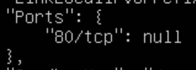

# Simple Docker

## Part 1. Готовый докер

* Вначале выполнил команды: ```sudo apt install docker``` и ```sudo apt install docker.io```
* Взял официальный докер-образ с nginx и выкачал его при помощи команды ```sudo docker pull```.

    

* Проверил наличие докер-образа через ```docker images```.

    

* Запустил докер-образ через ```docker run -d [image_id|repository]```.

    

* Проверил, что образ запустился через ```docker ps```.

    

* Посмотрел информацию о контейнере через ```docker inspect [container_id|container_name]```.

* По выводу команды определил и поместил в отчёт 
    размер контейнера:

    

    список замапленных портов:

    

    и ip контейнера:

    

* Остановил докер образ через ```docker stop [container_id|container_name]```.

    

* Проверил, что образ остановился через ```docker ps```.

    

**Запустил докер с портами 80 и 443 в контейнере, замапленными на такие же порты на локальной машине, через команду run.**

* Поскольку докер запущен на виртуальной машине, то чтобы зайти на сервер nginx с браузера основной машины, нужно настроить виртуальный адаптер хоста:

1) в ```"File/Network Manager"``` выбираем Host-only Networks и создаем сеть vboxnet0

    

2) Настроим ```Сеть в VirtualBox``` на Host-only Network

    

3) Виртуальному адаптеру назначен ip адрес 192.168.56.2 -> Проверим соединение с основной машины до виртуальной машины командой ```ping```

    

4) Запустил докер с портами 80 и 443 в контейнере, замапленными на такие же порты на локальной машине, через команду ```run``` -> проверил соединение командой ```curl```

    

5) Открыл на браузере основной машины сервер nginx через виртуальный адаптер по адресу 192.168.56.2

    

* Перезапустил докер контейнер через ```docker restart [container_id|container_name]```    
* Командой ```curl проверил соединение с сервером```

    

## Part 2. Операции с контейнером

* Прочитал конфигурационный файл nginx.conf внутри докер контейнера через команду ```exec```.

    * Зашел в контейнер

    

    * перешел в директорию nginx

    

    * открыл файл конфига

    

    * вышел из контейнера

    

* Создал на локальной машине файл *nginx.conf*.

* Настроил в нем по пути */status* отдачу страницы статуса сервера nginx.

    

* Скопировал созданный файл *nginx.conf* внутрь докер-образа через команду ```docker cp```.

    

* Перезапустил nginx внутри докер-образа через команду ```exec```.

    

* Проверил, что по адресу *localhost:80/status* отдается страничка со статусом сервера nginx.

    

* Экспортировал контейнер в файл *container.tar* через команду ```export```.
* Остановил контейнер.

    

* Удалил образ через ```docker rmi [image_id|repository]```, не удаляя перед этим контейнеры.

    

* Удали остановленный контейнер.

    

* Импортировал контейнер обратно через команду ```import```.

    

* Запустил импортированный контейнер.

    

* Проверил, что по адресу *localhost:80/status* отдается страничка со статусом сервера nginx.

    

## Part 3. Мини веб-сервер

* Напишем мини-сервер на C и FastCgi, который будет возвращать простейшую страничку с надписью Hello World!.

* Чтобы создать свой мини веб-сервер, необходимо создать .c файл, в котором будет описана логика сервера (в нашем случае - вывод сообщения Hello World!), а также конфиг nginx.conf, который будет проксировать все запросы с порта 81 на порт 127.0.0.1:8080

* Запустим контейнер на порту 81

    

* Перейдем в контейнер с помощью команды ```sudo docker exec -it ``` предварительно узнав название командой ```sudo docker ps -a```

    

    

* Обновим систему командой ```apt update``` и установим необходимы пакеты ```apt install gcc vim spawn-fcgi libfcgi-dev```

    
 
* В директории ```home``` создадим файл и напишем следующий код на Си

    

* Изменим файл ```/etc/nginx/nginx.conf``` следующим образом (поставил порт 81 на прослушивание и подключил fastcgi), т.е проксирование всех запросов с порта 81 на 127.0.0.1:8080

    

    

* Перейдем в директорию ```home``` и скомпилируем файл Си

    

* Запустим испольняемы файл на порту 8080 используя spawn-fcgi и перечитаем файл конфигурации nginx без остановки работы командой ```nginx -s reload```

    

* Командой ```curl localhost:81``` убедимся, что сервер корректно отвечает на запрос

    

* Подключив виртуальный адаптер хоста убедимся в корректной работе сервера через браузер

    

    


**Если сервер работает некоректно или возвращает ошибку, то сноси контейнер с образом и устанавливай по новой !!!**

## Part 4. Свой докер
* Напишем докер-образ для созданного сервера, который будет:

    1) собирать исходники мини сервера на FastCgi из Части 3;

    2) запускать его на 8080 порту;

    3) копировать внутрь образа написанный ./nginx/nginx.conf;

    4) запускать nginx.

* nginx можно установить внутрь докера самостоятельно, а можно воспользоваться готовым образом с nginx'ом, как базовым. Используем второй способ.

* Dockerfile и run.sh

    

    

* Собрал написанный докер-образ через docker build при этом указав имя и тег командой ```sudo docker build -t miniserver:1 .```

    

* Проверил через docker images, что все собралось корректно ```sudo docker images```.

    

* Запустил собранный докер-образ с маппингом 81 порта на 80 на локальной машине и маппингом файла nginx.conf внутрь контейнера по адресу, где лежат конфигурационные файлы nginx'а (см. Часть 2).
```sudo docker run -d -p 80:81 -v $(pwd)/nginx.conf:/etc/nginx/nginx.conf miniserver:1```

    

* Проверил, что по localhost:80 доступна страничка написанного мини сервера.

    

* Проверил что в данный момент в ```localhost:80/status``` не отображается статус

    

* Дописал в /nginx.conf проксирование странички /status, по которой надо отдавать статус сервера nginx.

        

* Перезапусти докер-образ. Если всё сделано верно, то, после сохранения файла и перезапуска контейнера, конфигурационный файл внутри докер-образа должен обновиться самостоятельно без лишних действий

* Проверил, что теперь по localhost:80/status отдается страничка со статусом nginx

    

## Part 5. Dockle

* После написания образа проверим его на безопасность

* Установим докл с удаленного репозитория командой ```curl -L -o dockle.deb https://github.com/goodwithtech/dockle/releases/download/v0.4.10/dockle_0.4.10_Linux-64bit.deb``` далее введем команду для установки пакета ```sudo dpkg -i dockle.deb```.

    

    

* Просканировал образ из предыдущего задания командой ```dockle [image_id|repository]```.

    

* Исправил Dockerfile.

    

    * выполним команду ```sudo docker build -t server:1 .``` с уже измененным докер файлом

        

    * Докл после изменения докер файла

        

* Предупреждения об ошибках докл и их описания:

    * CIS-DI-0001
    > Создайте пользователя для контейнера
    > Создайте пользователя, не являющегося пользователем root, для контейнера в Dockerfile для образа контейнера.

    > Хорошей практикой является запуск контейнера от имени пользователя, не имеющего прав root, если это возможно.

    * CIS-DI-0005
    > Включите доверие к контенту для Docker. По умолчанию доверие к контенту отключено. Его следует включить. ```export DOCKER_CONTENT_TRUST=1``` перед пулом или билдом контейнера


    * CIS-DI-0006
    > Добавить HEALTHCHECK инструкция к изображению контейнера
    > Добавить HEALTHCHECK инструкция в ваших образах контейнеров docker для выполнения проверки работоспособности запущенных контейнеров.
    > На основе сообщенного состояния работоспособности движок docker затем может завершить работу с нерабочими контейнерами и создать экземпляры новых.
        Dockerfile:
            > HEALTHCHECK --interval=5m --timeout=3s \
            > CMD curl -f http://localhost/ || exit 1

    * CIS-DI-0008
    > Подтвердите безопасность setuid и setgid Файлы
    > Удаление setuid и setgid разрешения в изображениях предотвратили бы атаки с повышением привилегий в контейнерах.
    > setuid и setgid разрешения могут быть использованы для повышения привилегий.
        Dockerfile:
            > chmod u-s setuid-file
            > chmod g-s setgid-file

    * DKL-DI-0005

    > Очистить apt-get кэши

    > Использование apt-get clean && rm -rf /var/lib/apt/lists/* после apt-get install.

        > https://docs.docker.com/develop/develop-images/dockerfile_best-practices/#apt-get

        > Кроме того, когда вы очищаете apt cache путем удаления /var/lib/apt/lists это уменьшает размер изображения, поскольку кэш apt не хранится в слое. Поскольку RUN утверждение начинается с apt-get update, кэш пакета всегда обновляется перед запуском apt-get install.


## Part 6. Базовый Docker Compose

* Установил docker-compose командой ```sudo curl -L "https://github.com/docker/compose/releases/download/1.29.2/docker-compose-$(uname -s)-$(uname -m)" -o /usr/local/bin/docker-compose```

    

* Написал файл docker-compose.yml, с помощью которого:

1) Поднимется докер-контейнер из Части 5 (он должен работать в локальной сети, т.е. не нужно использовать инструкцию EXPOSE и мапить порты на локальную машину).

2) Поднимется докер-контейнер с nginx, который будет проксировать все запросы с 8080 порта на 81 порт первого контейнера.

    

* Замапил 8080 порт второго контейнера на 80 порт локальной машины.

* Остановил все запущенные контейнеры командой ```sudo docker-compose down```

* Собрал и запустил проект с помощью команд ```sudo docker-compose build``` и ```sudo docker-compose up```.

    

* Проверил, что в браузере по localhost:80 отдается написанная тобой страничка, как и ранее (через виртуальный адаптер, т.к докер стоит на виртуальной машине).

    

* Более подробный гайд по docker-compose можно увидеть по этой ссылке https://www.digitalocean.com/community/tutorials/how-to-install-and-use-docker-compose-on-ubuntu-20-04

